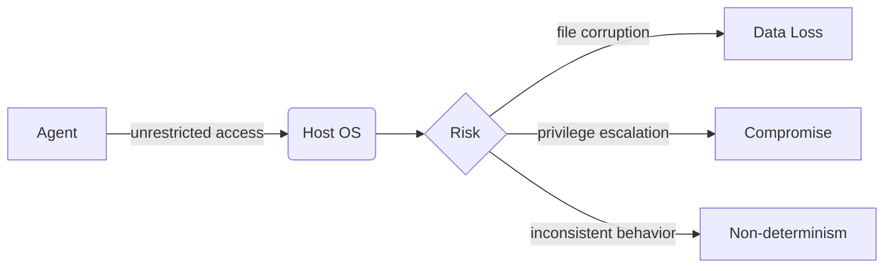
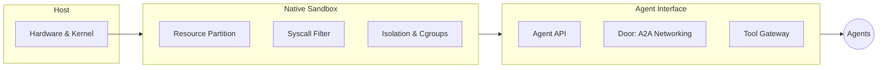
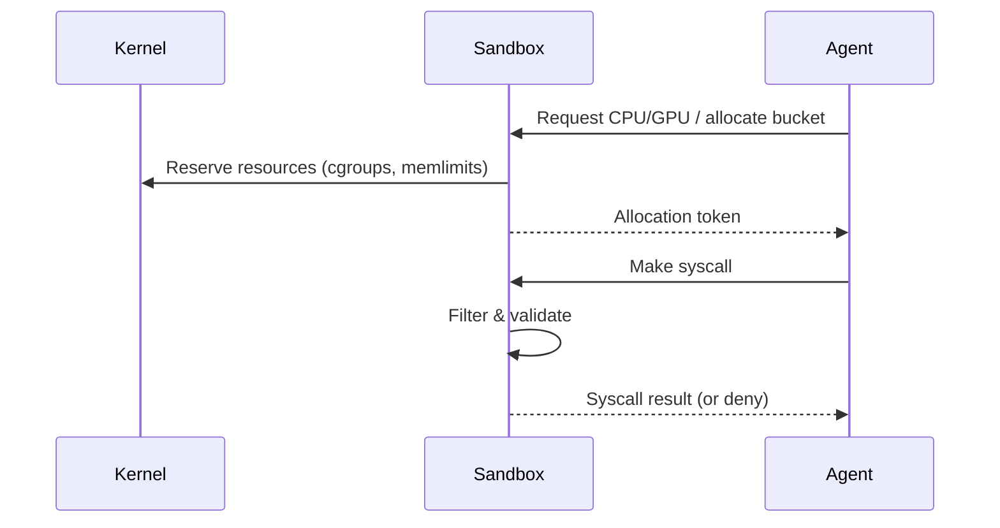
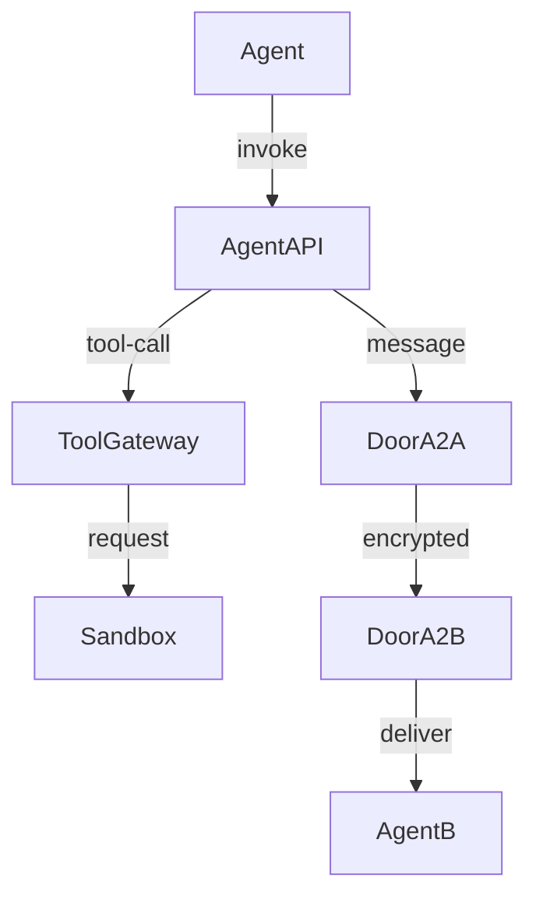
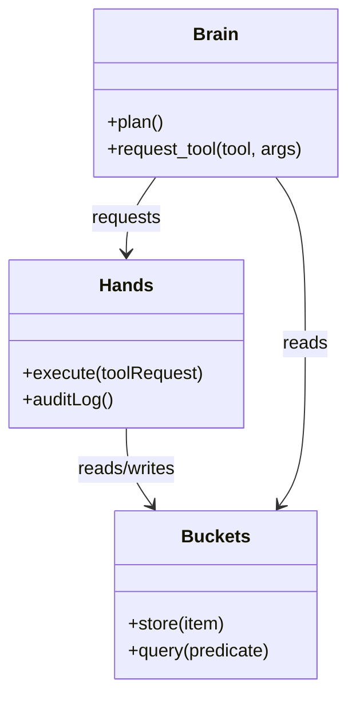
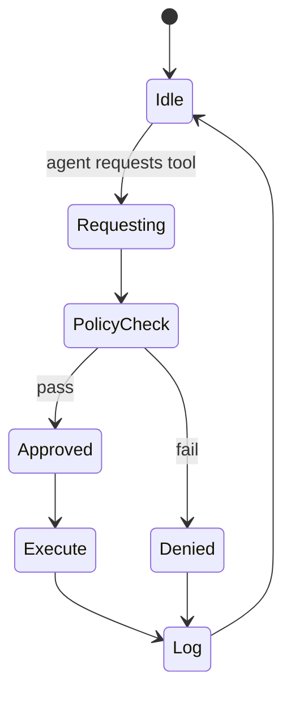
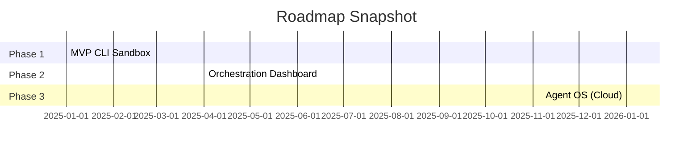
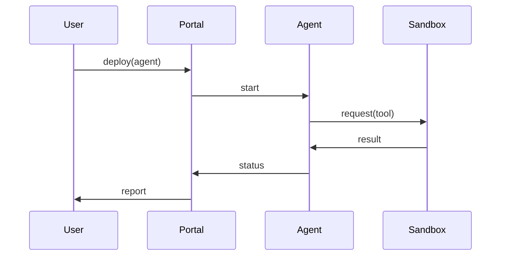

# MominAI: The Native Execution Layer for Autonomous Agents 🚀

**White Paper & Strategic Infrastructure Overview**

---

## Table of Contents
1. Executive Summary
2. Problem: Why "Flat" Agent Architectures Fail
3. The MominAI Solution: Two-Layered Architecture
  - Layer 1: Native Sandbox (Low-Level Engine)
  - Layer 2: Agent Interface (High-Level Substrate)
4. Core Primitives: Brains, Hands, and Buckets
5. Security & Governance Model
6. Deployment, Orchestration & Observability
7. Roadmap & Timeline
8. Use Cases & Integration Examples
9. Metrics, SLAs, and Adoption Strategy
10. Appendix: Contact & Licensing

---

## 1. Executive Summary ✨
MominAI provides a native, kernel-adjacent execution substrate for autonomous agents. Instead of retrofitting agents into generic containers and brittle runtime layers, MominAI offers a purpose-built runtime (C + Rust) that treats agent cognition as a first-class system activity. We aim to enable safe, deterministic, and auditable autonomous AI at enterprise scale.

> Key outcomes: deterministic behavior, hierarchical isolation, fine-grained capability control, and cross-agent secure communication.

---

## 2. Problem: Why "Flat" Agent Architectures Fail ⚠️
Contemporary agent stacks (AutoGPT, CrewAI, etc.) expose several critical failure modes:

- **Systemic Risk:** Local file or terminal access without principled limits can let a single mistake escalate into host compromise.
- **Container Misfit:** Docker and process containers were designed for service workloads, not recursive agent planning and nested execution.
- **Non-determinism:** Execution drift across environments undermines reproducibility and compliance.

---

## 3. The MominAI Solution: Two-Layered Architecture 🏗️
MominAI splits concerns into two layers:

- **Layer 1: Native Sandbox** — a low-level engine that partitions hardware, enforces syscall policies, and provides recursive sandboxing.
- **Layer 2: Agent Interface** — a framework-agnostic substrate for loading and composing agents, exposing safe tool APIs and secure inter-agent channels (A2A Doors).

### 3.1 Layer 1: Native Sandbox 🔐
Responsibilities:
- Hardware partitioning (RAM, CPU quotas, GPU slices)
- Hierarchical, recursive isolation (Parent → Sub-agent sandboxes)
- Zero-trust syscall filtering and capability enforcement

### 3.2 Layer 2: Agent Interface 🧩
Capabilities:
- Framework adapters (LangChain, AutoGen, OpenAI SDKs)
- Tool gating via the Hands API
- Secure A2A channels (Doors) that do **not** leak internal memory

---

## 4. Core Primitives: Brains, Hands, and Buckets 🧠🤖🪣
These abstractions formalize how agents think, act, and remember:

- **Brain (Cognition):** The LLM or reasoning loop that proposes actions. It has NO direct side effects.
- **Hands (Tools):** Mediated capabilities (File access, networking, package install) executed by the sandboxed tool gateway.
- **Buckets (Persistent Knowledge):** Verifiable, append-only stores for long-term memory, models, and sub-agent outputs.

---

## 5. Security & Governance Model 🛡️
Goals: least privilege, auditable decisions, and deterministic replay.

- **Policy Engine:** Declarative capability policies per-agent (e.g., allowed tools, max-cycles, resource caps).
- **Attestation & Audit:** Every tool call and state change is signed and logged for forensics and replay.
- **Deterministic Replay:** Capture seeds/sessions so reasoning traces can be replayed for compliance.

---

## 6. Deployment, Orchestration & Observability 🔭
- **Local (Phase 1):** CLI sandbox for developers and auditors.
- **Dashboard:** React-based orchestration with real-time resource and policy tuning.
- **Cloud-Scale:** Multi-tenant "Agent OS" with namespaces, quotas, and federated routing.

---

## 7. Roadmap & Timeline 📅
**Phase 1 (MVP)** — Secure local runtime, basic tool gating, Buckets v0.

**Phase 2** — Rich orchestration UI, detailed auditing, integration adapters.

**Phase 3** — Cloud-scale Agent OS: multi-region orchestration, federated policy, tenant isolation.

---

## 8. Use Cases & Integration Examples 💡
- **Enterprise Automation:** Run autonomous workflows with strict audit trails.
- **Cybersecurity Automation:** Sandboxed agents triage alerts, run remediation playbooks without risking escalation.
- **Agent Marketplace:** Verified agent bundles that can be run safely across fleets.

---

## 9. Metrics, SLAs, and Adoption Strategy 📊
- **Safety:** failed containment incidents per 1M agent-hours (goal: ~0)
- **Determinism:** percentage of replayed sessions that match original outputs
- **Performance:** average resource overhead per agent
- **Adoption:** enterprise pilot -> compliance audit -> production roll-out

---

## 10. Appendix & Contact 📎
**Founder:** Momin Aldahdouh

**Contact:** momin.aldahdooh@gmail.com

**GitHub:** https://github.com/Momin010

